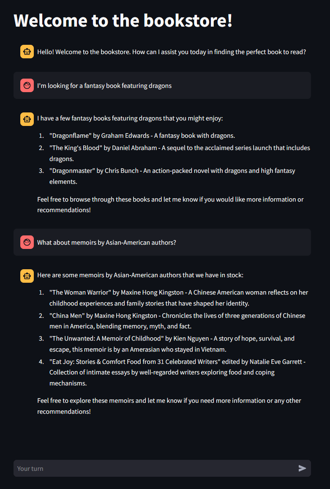
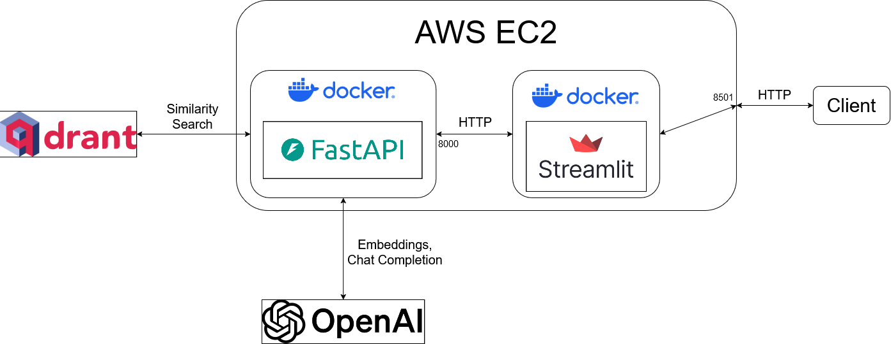

# <u>RAG Book Recommendation Chatbot</u>

For the third and final module (MLOps) of my bootcamp, I created a RAG book recommendation chatbot. The user posts a message to the application, the message is embedded and used to retrieve books from a vector database, and the message and retrieved books are passed to the chat completion model, which generates a response that is sent back to the user.

[Code repo](https://github.com/rfdspeng/ml_ai_portfolio/tree/main/book_recommender)

**Tools, libraries, and APIs:**
* FastAPI (backend)
* Streamlit (frontend)
* OpenAI (text embedding and chat completion)
* Qdrant (vector database and similarity search)
* Docker and Docker Compose (containerization and networking)
* AWS ECR, AWS EC2 (deployment)

**UI:**



**Architecture:**



**Project directory structure:**

```python
.
├── backend
│   ├── __init__.py
│   ├── dependencies.py             # Dependency functions to inject BookRetriever into /chat/ operation function
│   ├── main.py                     # Create one instance of BookRetriever to be shared among all users
│   ├── models
│   │   ├── __init__.py
│   │   ├── assistant.py            # BookAssistant class definition
│   │   └── retriever.py            # BookRetriever class definition
│   └── routers
│       ├── __init__.py
│       └── chat.py                 # /chat/ endpoint
└── frontend
    └── app.py                      # Streamlit application for UI
```

**Future work:**
* Machine learning improvements
    * Add intent classifier to classify the user query into requiring retrieval (e.g. "Recommend me a fantasy book") or not requiring retrieval (e.g. "How are you doing?")
    * Add NER classifier to extract key information from the user query (e.g. author, rating, popularity, etc.) to use for metadata filtering during retrieval
    * Add NLP summarizer to summarize long book descriptions before passing to chat completion model (currently, descriptions are arbitrarily truncated to 150 characters)
* MLOps improvements
    * Implement unit tests
    * Implement CI with GitHub Actions
    * Redesign the frontend using an asynchronous framework to better support concurrent users

## <u>Backend</u>

The backend is implemented using the **FastAPI** framework and provides a single endpoint, `/chat/`, to handle user messages. 

**Key components:**
* Models
    * Embedding: OpenAI `text-embedding-ada-002`
    * Chat completion: OpenAI `gpt-3.5-turbo`
* Vector database: [Qdrant](https://qdrant.tech/)
* Endpoint
    * Path: `/chat/`
    * Request: accepts a JSON object
        ```
        {
            "userid": "exampleuserid",
            "message": "I'm looking for a fantasy book featuring dragons."
        }
        ```
    * Response: returns a JSON object
        ```
        {
            "response": "Based on your preference for a fantasy book featuring dragons, here are some recommendations from our bookstore:\n\n1. \"Dragonflame\" by Graham Edwards - This book falls under the Fantasy genre and features dragons. Unfortunately, there is no description available for this book at the moment.\n\n2. \"Pete's Dragon (Little Golden Book)\" by Walt Disney Company - This children's book is a Fantasy story that includes dragons. It combines elements of humor, animals, and fantasy for an enjoyable read.\n\n3. \"Free Fall\" by David Wiesner - While this is a Picture Book, it also includes dragons in the story. It follows a young boy's dream about dragons, castles, and a faraway land, offering an adventurous and imaginative read.\n\n4. \"Dragonmaster\" by Chris Bunch - A fantasy novel that features dragons, war, and magic. It promises action-packed adventure in a fantastical setting.\n\n5. \"The King's Blood\" by Daniel Abraham - This book is an Epic Fantasy sequel that includes dragons in its narrative. It is filled with war, adventure, and a rich fantasy world for readers to immerse themselves in.\n\nFeel free to explore these options and see which one intrigues you the most for your next fantasy read! Let me know if you need more information on any of these books."
        }
        ```
    * Path operation
        * Embed `message`
        * Retrieve similarity search results from vector database
        * Concatenate `message` with search results and pass to chat completion model, then return the generated response
    * Classes
        * `BookRetriever`
            * Asynchronously embeds user queries and retrieves similarity search results
            * A single `BookRetriever` instance is created in the FastAPI `lifespan` context and shared among all users to reduce overhead
        * `BookAssistant`
            * Asynchronously generates responses, given `message` and the search results, and maintains conversation history
            * Each user gets their own `BookAssistant` instance, stored by user ID in a dictionary in memory, alongside a mutex lock to prevent race conditions

## <u>Frontend</u>

The frontend is implemented using **Streamlit**. The frontend is responsible for the UI, for generating unique user IDs, and for sending HTTP POST requests to the backend.

## <u>Containerization and networking</u>

This project uses separate Docker containers for the backend and frontend.

### <u>Architecture</u>
* Backend container
    * Exposes port 8000
    * Accessible only to the frontend via a virtual Docker network named `app-network`
* Frontend container
    * Exposes port 8501, which is forwarded to port 8501 on the host machine
    * Provides the user interface accessible in a web browser

Refer to `./compose.yaml` for the Docker Compose configuration.

### <u>Setup instructions</u>
1. Create a file called `./backend/.env` with these environmental variables defined:
    ```
    QDRANT_URL=<my-qdrant-cluster-url>
    QDRANT_API_KEY=<my-qdrant-api-key>
    OPENAI_API_KEY=<my-openai-api-key>
    ```
2. Install Docker and Docker Compose on your machine
3. In your terminal, navigate to the directory containing `compose.yaml` and execute `docker compose up`. This command builds and starts both containers.
4. Open your web browser and navigate to `http://localhost:8501` to access the application UI

## <u>Dataset and embedding</u>

This [dataset](https://github.com/scostap/goodreads_bbe_dataset) contains scraped books data from Goodreads, including fields like description, genre, number of ratings, rating on a 5-star system, etc.

For each book, I concatenated the book description with the genres list, fed them into the text embedding model, and then stored the embeddings, along with metadata, into the vector database.