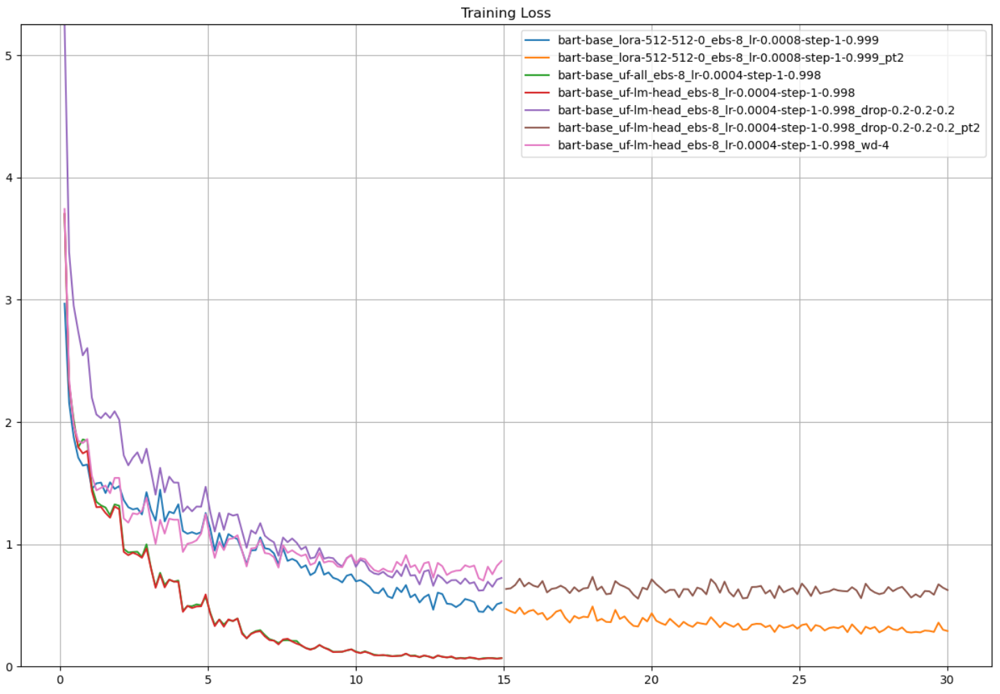
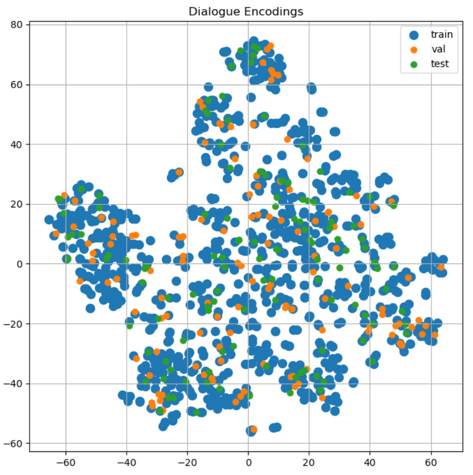

# **<u>Clinical Dialogue Summarization</u>**

**Libraries**

**Concepts: LoRA**

 
## **<u>Project Summary</u>**

For my second deep learning project, I chose to fine-tune a transformer model for text summarization. I've personally found summarization to be very useful, and I wanted to explore text generation as it's one of the most interesting and complex applications of AI.

**Ultimately, the fine-tuned model does not generalize because of the small and noisy dataset, which I explain below.**

**I found a [dataset](https://huggingface.co/datasets/har1/MTS_Dialogue-Clinical_Note) on Hugging Face that summarizes transcribed clinical dialogue.** It’s a modified version of this [dataset](https://github.com/abachaa/MTS-Dialog). The team that uploaded the modified dataset to Hugging Face added structure to the summaries, converting them from paragraph format to bullet-point format with 4 bullets: symptoms, diagnosis, patient history, and plan of action. The team only uploaded the training and validation splits.

The original dataset was intended for training both summarization and classification into medical categories, but for simplicity, I only attempted summarization.

The team that uploaded the dataset fine-tuned “facebook/bart-large-cnn”, but **I chose to fine-tune “facebook/bart-base” for efficiency and because the dataset is very small – only 1301 samples.**

**These are my key discoveries from fine-tuning on this dataset:**
* **For accurate summaries, mean cross-entropy loss needs to be < 0.4. The model hallucinates at higher losses, which can drastically alter the meaning of the clinical note.**
	* With the language modeling head unfrozen or 38M trainable parameters, training loss is 0.07 after 15 epochs
	* With all layers unfrozen or 140M trainable parameters, training loss is 0.07 after 15 epochs (almost no difference from unfreezing only the language modeling head)
	* With the base model frozen and LoRA applied with rank=512 or 28M trainable parameters, training loss is 0.29 after 30 epochs
* **In all cases, the model overfits.** Validation loss increases as training progresses and never falls below 1. **The dataset is too small and the task is too complex for the model to generalize – applying dropout and weight decay degrades both training and validation loss.** The model generates summaries that are in the correct format and may even contain correct information, but **the model often hallucinates, either contradicting the ground truth or contradicting itself.**
* The dataset is too small and too noisy for the complexity of the task. **For a given sample, there aren’t enough similar samples; some samples contain almost no information; and some samples have inaccurate ground truth summaries.**
	* Training across 5-fold training/validation splits are nearly identical, which means the problem isn’t splitting
	* Encoding the dialogue and summary using a SentenceTransformer and then plotting the encodings using t-SNE shows that the dataset is quite scattered. I break down a specific example below.
	* I generated summaries using dataset team’s model, and their model performs poorly

 
## **<u>Training and Validation Loss</u>**

The plots below summarize the training results: I can achieve good training performance by either unfreezing layers in the base model or applying high-rank LoRA adaptation, but **regularization degrades both training and validation performance.**

Model configurations (top to bottom in the legend):
1. LoRA (r = 512, alpha = 512, dropout = 0), effective batch size = 8, initial learning rate = 8e-4, StepLR(step_size = 1, gamma = 0.999)
2. Continuation of training from #1
3. Unfreeze all layers, effective batch size = 8, initial learning rate = 4e-4, StepLR(step_size = 1, gamma = 0.998)
4. Unfreeze language modeling head, effective batch size = 8, initial learning rate = 4e-4, StepLR(step_size = 1, gamma = 0.998)
5. Unfreeze language modeling head, effective batch size = 8, initial learning rate = 4e-4, StepLR(step_size = 1, gamma = 0.998), dropout = 0.2 (default 0.1)
6. Continuation of training from #5
7. Unfreeze language modeling head, effective batch size = 8, initial learning rate = 4e-4, StepLR(step_size = 1, gamma = 0.998), weight decay = 4 (default 0)

Compare **4-7**, which all unfreeze the language modeling head. **4 (red)** is with default dropout, **5-6 (purple-brown)** is with all dropout rates set to 0.2, and **7 (pink)** is with weight decay set to 4.

 
## **<u>Dataset Visualization and Analysis</u>**

I investigated the dataset to try and find the reason why the model wasn't generalizing.
1. First, I trained on 5 train/val folds to rule out the train/val split. Training was nearly identical in all 5 runs.
2. Second, I used a SentenceTransformer to encode the dialogues and summaries and then applied t-SNE to visualize the samples in 2D.

At first glance, the samples looked fine - nearly every validation and test sample is surrounded by training samples.

In the 2D space, by distance, validation sample ID **209** has the closest training sample match. For **209**, I found the top 5 closest samples from training, validation, and test splits. Since **209** is about fractures and surgeries, I also searched the dialogues for any mention of fracture/fractures/fractured. 

After reading through the sample texts, I identified only 8 samples related to fractures and surgery, which isn't enough samples for a task of this complexity. I ran these samples through my model. The model generates perfectly matching summaries for the training samples but performs very poorly on the validation and test samples.

 
### **<u>Hallucinations</u>**

It's not just BERTScore and ROUGE - the model hallucinates. Take **209** for example:

<u>Dialogue</u>

>Doctor: Good morning, young man. Are these your parents?  
>Patient: Yes.  
>Doctor: Good, can you tell me more about your son, please?  
>Guest_family_1: Well, he's five now, and **he fell onto his right arm** on December fifth two thousand seven.  
>Doctor: After he fell, how was he treated?  
>Guest_family_1: We went to the E D right after he fell, and they said he had **complete fractures of both bones in the arm.**  
>Doctor: Yes, I see that here, he also has shortening bayonet apposition.  
>Guest_family_1: What can we do for this?  
> Doctor: There's actually a few options here. First we can cast it and see how he heals, generally, children heal up very well from fractures.  
> Guest_family_1: That's good, we like that option more than any kind of surgery.  
> Doctor: However, **surgery is also an option here as well.**  
> Guest_family_1: Yeah, to be completely sure we fix this, I think we should opt for the surgery, what do you think, honey?  
> Guest_family_2: Yes, I agree. What are the risks of infection for this surgery?  
> Doctor: **The risk of infection is very low**, generally less than one percent. We use antibiotics to control for infection.  
> Guest_family_1: Will he be asleep for the surgery?  
> Doctor: Absolutely, he won't feel a thing. **Other risks include bleeding, changes in sensation and motion of the extremity, hardware failure, and need for later hardware removal, and cast tightness. I would not worry about these risks. We have great results with these surgeries.**  
> Guest_family_1: Then yes, we'd like to do the surgery.  

<u>Summary</u>

> Symptoms: **refracture** of right forearm  
> Diagnosis: complete fractures of both bones in right arm, shortening bayonet apposition  
> History of Patient: fell onto right arm on December 5, 2007  
> Plan of Action: surgery for **closed reduction and pinning**, with risks including anesthesia, infection, bleeding, changes in sensation and motion of extremity, hardware failure, need for later hardware removal, cast tightness  

<u>Prediction</u>

> Symptoms: fell onto right arm on December 5, 2007, **incomplete fractures** of both bones in right arm, shortening bayonet apposition, possible need for later hardware removal and possible continuous nerve Symptoms  
> Diagnosis: N/A  
> History of Patient: fell onto right arm on December 5, 2007, **incomplete fractures of both bones, received physical therapy and bandaging, no other surgeries recommended due to risk of infection**  
> Plan of Action: **Surgery recommended due to non-healing extremity injuries**, risks of infection discussed and patient agreed to surgery after informed consent  

**<u>Analysis:</u> The model is hallucinating – it thinks the fractures are incomplete fractures and contradicts itself by saying that surgery is both recommended and not recommended due to risk of infection.**

**The ground truth summary contains information not present in the dialogue (noisy dataset).**

 
### **<u>Samples Without Information, Noise</u>**

