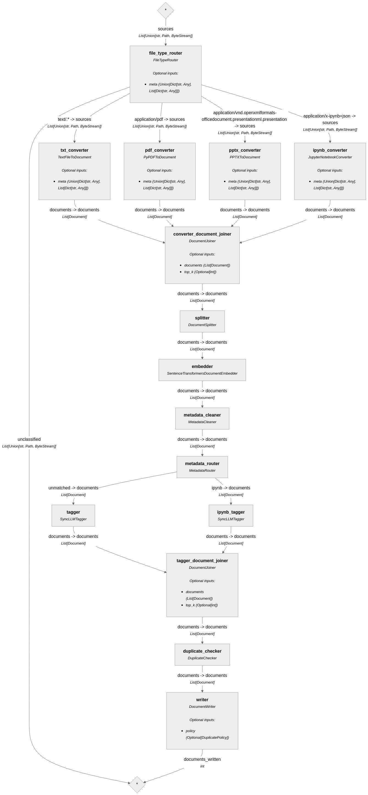
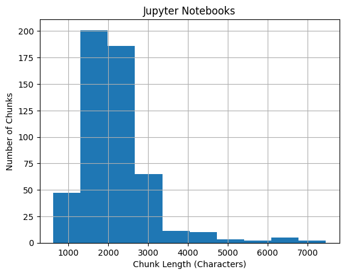
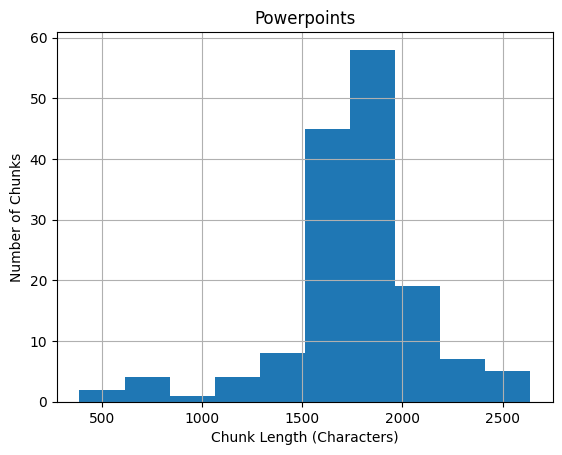

# <u>Project summary</u>

_[Repo](https://github.com/rfdspeng/content-tagging-pipeline) is copied to my personal repo with permission from [Beam Data](https://beamdata.ai/)._

This project implements a content indexing and tagging pipeline for data science educational materials. Tagging is achieved by few-shot prompting an LLM. The application is designed for deployment to AWS Lambda, and the vector database that stores the embeddings and content will be used in a downstream RAG pipeline to answer student questions. I led the project, from pipeline design and prompt engineering to evaluation and deployment.

Beam Data provided the foundational tech stack but left the design and implementation of the pipeline to the consulting team.
* ML framework: [Haystack](https://haystack.deepset.ai/)
* Embedding model: `sentence-transformers/all-mpnet-base-v2`
* LLM API for tagging: OpenAI
* Vector database service: [Zilliz](https://zilliz.com/) (Milvus)
* Cloud platform (for deployment): AWS

Tags: Data Analysis, Data Engineering, Data Science, Infrastructure and Operations, Machine Learning Engineering. See `app/haystack_utilities/ml/tagging_prompts.py` for the few-shot prompts.

<u>Tagging performance by file type</u>  

|File type|Recall %|Precision %|Total Number of Chunks|  
|---------|--------|-----------|----------------------|  
|Jupyter notebook|92.6|75.3|532|  
|PowerPoint|97.9|89.5|153|  
|HTML|TBD|TBD|TBD|  
|Markdown|TBD|TBD|TBD|  
|PDF|TBD|TBD|TBD|  
|Transcript|N/A|N/A|N/A|  

I excluded transcripts because they probably won't be useful as resources for the downstream RAG pipeline: Spoken language is full of noise, and video transcripts are missing the important visual information. I did not have time to assess PDF tagging performance; the other consultants were responsible for HTML and Markdown.

To build the image, install Docker, navigate to the `app` directory, and run the shell command `docker build -t content-tagging .`. To test the image locally and/or deploy the application to AWS Lambda, see the last section for the bash scripts.

I'll go over my process, design choices, and issues. For more information, see the remaining sections.

* **Pipeline**
    * _Haystack-Milvus integration_
        * During insertion, `MilvusDocumentStore` does not check if the primary key (ID) already exists in the vector database. IDs are generated by SHA-256 (`haystack.Document._create_id`) and are effectively unique; however, if the same file is passed through the pipeline multiple times, there will be duplicates in the database. Created custom component `DuplicateChecker` (`app/haystack_utilities/components/duplicate_checker.py`) to handle duplicate IDs before insertion.
        * `MilvusDocumentStore` was unable to insert ARRAY data fields into the vector database (e.g. for a list of tags). To work around this issue, I created the custom component `MetadataCleaner` (`app/haystack_utilities/components/metadata_cleaner.py`) to move all metadata to a dictionary and store it in a JSON data field.
    * _Chunking algorithm:_ Fixed chunk size of 250 words (embedding model has 384-token context window) with chunk overlap of 50 words. See _Splitting_ section for more information.
    * _Cleaning the text:_ Skipped the `DocumentCleaner` component because removing newlines and other formatting removes structure from the text, which could degrade retrieval and generation in the downstream RAG pipeline.
* **Database design:** See _Vector database collection creation_ section for schema and indexing.
* **Prompt engineering with few-shot prompting**
    * `{Desired tag}:{list of example topics}`, e.g. `"Machine Learning Engineering: AI, Generative AI, Natural Language Processing, Large Language Models, Computer Vision, MLOps"`, was not effective for tagging.
    * `{List of example topics in "conversational" language}:{desired tags}`, e.g. `Anything related to information retrieval and search engines: ["Data Science", "Machine Learning Engineering"]`, was much more effective for tagging.
    * Indicating that the content is from a Jupyter notebook improved notebook tagging performance. See _Tagging_ section for more information.
    * See `app/haystack_utilities/ml/tagging_prompts.py`
* **Tag averaging:** To filter out tagging noise and improve recall, I implemented a "tag averaging" algorithm - for each file, keep all tags that appear in >= X% of the chunks (X is configurable). Re-tag all chunks with the qualifying tags.
* **Labeling:** The "training" data for prompt engineering was unlabeled. To label the training files, I used a mix of manual and LLM labeling - (1) guess the labels, (2) compare the labels against the LLM tags, (3) update the labels.
* **Deployment:** AWS Lambda is the natural choice for this application due to the bursty traffic and short processing time of the pipeline.

# <u>Future work</u>

1. Jupyter notebooks and powerpoints are the main file types tested. Converting and tagging PDF, HTML, Markdown need to be tested.
2. The prompt includes "Business intelligence and Excel tutorials: ["Data Analysis"]". I would recommend removing "Excel tutorials" and avoid anything like this, e.g. "Pandas tutorials", "SQL tutorials". It causes the LLM to sometimes hallucinate the tag as "X tutorial".
3. In `lambda_function.py`, the pipeline is instantiated in `lambda_handler` to ensure that the OpenAI and Zilliz client connections are active for each invocation. Another option is to instantiate the pipeline outside of `lambda_handler` and use a keep-alive directive to keep the connections active. See [Lambda best practices](https://docs.aws.amazon.com/lambda/latest/dg/best-practices.html).
4. The `DuplicateChecker` component checks for duplicate IDs before inserting into the vector database. There may be a race condition, however, if the same file is simultaneously uploaded multiple times and processed by the pipeline. One option is to create a new component that calls Milvus's `upsert` method, which checks for duplicate IDs. If this is atomic, then it solves the race condition. Another option is to use a cache layer or lock to ensure atomic insertion.
5. There seems to be some run-to-run variation in the tagging through Lambda that should be investigated. Temperature is 0.

There are a couple of warning messages that are not important.
1. **No abbreviations file found for en. Using default abbreviations.** When you run the pipeline, it checks whether it needs to "warm up" any of the components (components that need to warm up will have a `warm_up` method). This warning comes from warming up `DocumentSplitter` when `DocumentSplitter._use_sentence_splitter` is `True`: `DocumentSplitter.warm_up` -> `SentenceSplitter.__init__` -> `SentenceSplitter._read_abbreviations` -> checks if `site-packages/haystack/data/abbreviations/en.txt` exists (which it doesn't). It looks like this file can be used to specify additional abbreviations on top of the default abbreviations in the sentence tokenizer (see `SentenceSplitter.sentence_tokenizer._params.abbrev_types`).
2. **Xet Storage is enabled for this repo, but the 'hf_xet' package is not installed. Falling back to regular HTTP download. For better performance, install the package with: `pip install huggingface_hub[hf_xet]` or `pip install hf_xet`.** This message appears if `huggingface-hub`'s version is >= 0.30.0. Adding `hf-xet` to `requirements.txt` causes the Lambda function to fail. See https://huggingface.co/docs/hub/en/storage-backends.

# <u>Vector database collection creation</u>

See `haystack_utilities.tools.milvus_utils.create_collection` for code.

**_<u>Schema</u>_**  

|Field Name|Field Type|Notes|
|----------|----------|-----|
|`id`|`VARCHAR(64)`|`id` is a 64-character string. It is generated by the Haystack pipeline using SHA-256 (see `haystack.Document._create_id`).|
|`vector`|`FLOAT_VECTOR(768)`|768-dimension vector for `sentence-transformers/all-mpnet-base-v2` embedder. `vector` is the only indexed field.|
|`text`|`VARCHAR(65535)`|Text chunk. Length is configurable but must be between 1 and 65535 inclusive per Zilliz documentation (see Lambda deployment and pipeline splitting for sample chunk length histograms).|
|`metadata`|`JSON`|See below|

`metadata` keys:
* `tags`: list of `str` tags
* `source_id`: 64-character `str` that represents the original file (generated by Haystack pipeline)
* `title`: file name
* `file_type`: file extension, e.g. `.pdf`
* `page_number`: file page number that the text chunk is from
* `split_overlap_ids`: `id`s of the other chunks that overlap this chunk

**_<u>Index</u>_**
```python
index_params.add_index(
    field_name="vector",
    metric_type="COSINE", # sentence-transformers/all-mpnet-base-v2 embeddings are L2-normalized
    index_type="AUTOINDEX", # Recommended by Zilliz
    index_name="vector",
)
```

Consistency level is set to `"Strong"` to ensure that database searches use the latest available data. See https://docs.zilliz.com/docs/consistency-level.

# <u>Indexing+tagging pipeline</u>

## _<u>Diagram</u>_



## _<u>File conversion</u>_

The pipeline starts by converting files to Haystack `Documents`. The pipeline routes to different converters based on MIME type:

|MIME type|Converter|Notes|
|---------|---------|-----|
|`text/.*`|Haystack's `TextFileToDocument`|This routes text files, HTML, Markdown, VTT. Haystack has `MarkdownToDocument` and `HTMLToDocument` converters, but we haven't evaluated these.|
|`application/pdf`|Haystack's `PyPDFToDocument`|Uses `pypdf` library|
|`application/vnd.openxmlformats-officedocument.presentationml.presentation`|Haystack's `PPTXToDocument`|Uses `python-pptx` library|
|`application/x-ipynb+json`|Custom `JupyterNotebookConverter`|Converts notebook (JSON format) to Markdown|

**Important note:** Video transcripts are generally not a good format for this application. There is a lot of noise/filler/useless information in transcripts, and even the useful information is not very useful without the video.

## _<u>Cleaning (Optional)</u>_

Cleaning (Haystack's `DocumentCleaner`) is optional. It strips extra whitespaces and newlines, which can cause the text to lose structure. This makes it difficult to read the text and may be detrimental to generation in the RAG pipeline.

## _<u>Splitting</u>_

`splitter` supports fixed and recursive chunking via Haystack's `DocumentSplitter` and `RecursiveDocumentSplitter`. Pass the splitting options as a dictionary.

Mainly tested fixed chunking because the recursive splitter returned incorrect splitting metadata (split overlap, source ID, page number).

Default splitting options:
```python
# sentence-transformers/all-mpnet-base-v2
# Max tokens = 384
# Roughly 288 words (3 words = 4 tokens)
splitting_options = {
    "split_strategy": "fixed",
    "split_by": "word",
    "split_length": 250,
    "split_overlap": 50,
    "split_threshold": 30,
    "respect_sentence_boundary": True
}
```

```python
# Example options for recursive chunking
splitting_options = {
    "split_strategy": "recursive",
    "split_length": 100,
    "split_overlap": 20,
    "split_unit": "word",
    "separators": ["\f", "\n\n", "sentence", "\n", " "]
}
```

### **<u>Sample chunk length histograms</u>**





## _<u>Metadata normalization</u>_

`metadata_cleaner` normalizes metadata after splitting. Its main purpose is to move all metadata into a dictionary under the key `"metadata"` to prepare for insertion into the vector database. The pipeline was not able to insert into the vector database without this change.

## _<u>Embedding</u>_

`embedder` uses default options. The model is `sentence-transformers/all-mpnet-base-v2` with a max input length of 384 tokens and an embedding dimension of 768.

## _<u>Tagging</u>_

After embedding, the pipeline routes to two branches based on file type. Each branch has its own tagger. `ipynb_tagger` is for tagging Jupyter notebooks, while `tagger` is for all other file types. The reason is because the LLM tagger performs better for Jupyter notebooks when you tell it that the text chunk is from a Jupyter notebook that has been converted to Markdown. Did not test this for other file types.

Prompt engineering was conducted with `gpt-4o-mini`, `temperature=0`.

|Prompt|Recall|Precision|F1|
-------|------|---------|------|
|Did not specify that the chunk is from a Jupyter notebook|88.5%|77.1%|82.4%|
|Specified that the chunk is from a Jupyter notebook|92%|76.5%|83.5%|

The tagger returns a list of tags for each chunk. The tagger can return an empty list if none of the tags apply. For each file, tags are counted, and tags that appear > X% of the time are kept (X defaults to 30). Every tagged chunk (chunks with non-empty tag lists) is then tagged with all tags that meet the X% criterion. This "tag averaging" reduces noise.

Untagged chunks (chunks with empty tag lists) can be handled in one of three ways. This is a configurable option.
1. Keep untagged chunks and leave them untagged (for debugging). This is the default option.
2. Discard untagged chunks (because they don't contain much information)
3. Keep and tag the untagged chunks

## _<u>Duplicate checking</u>_

This component checks if the input `Document` IDs already exist in the vector database. Configuration options:
1. `delete`: Default option. Delete duplicate IDs from the vector database. All `Document`s will be inserted into the vector database.
2. `skip`: Remove duplicate input `Document`s. Only new `Document`s will be inserted into the vector database.
3. `disable`: Do not check for duplicate IDs. Duplicates may be inserted into the vector database.

`Document` IDs are generated by the splitter and do not change along the rest of the pipeline. However, this component is placed right before `DocumentWriter` to minimize the window for race conditions.

# <u>Deploying the Lambda function</u>

Required environment variables:
* `OPENAI_API_KEY`
* `ZILLIZ_CLUSTER_ENDPOINT`
* `ZILLIZ_CLUSTER_TOKEN`
* `COLLECTION_NAME`: Collection name to store the indexed chunks. If the collection does not exist yet, then the collection will be created.

Optional environment variables:
* `MAX_CHUNK_LENGTH_IN_CHARS`: Set the max text length in the vector database collection schema. This is only used if the collection does not exist yet. Defaults to 65535 (the maximum supported by Zilliz). See pipeline splitting for sample chunk length histograms.
* `SPLITTING_OPTIONS`: JSON string representing a dictionary of options for the pipeline `splitter`. If not set, then use default splitting options (see below).
* `SKIP_CLEANER`: Set to `true` to skip the pipeline `cleaner`. Defaults to `true`.
* `ADD_TAGGER`: Set to `true` to include `metadata_router`, `tagger`, `ipynb_tagger`, and `tagger_document_joiner` to the pipeline. Defaults to `true`.
* Tagging options
    * `TAGGING_MODEL`: Defaults to `gpt-4o-mini`
    * `TAGGING_TEMPERATURE`: Defaults to `0`. This is a float between 0 and 2 inclusive (OpenAI documentation).
    * `TAGGING_MAX_TOKENS`: Defaults to `30`. This is a positive integer.
    * `TAG_THRESHOLD`: Defaults to `0.3`. This is a float between 0 and 1 inclusive. See pipeline tagging section for more information.
    * `UNTAGGED_OPTION`: Defaults to `keep`. Other options are `discard` and `tag`. See pipeline tagging section for more information.
* `DEDUPLICATE_OPTION`: Defaults to `delete`. Other options are `skip` and `disable`. See pipeline duplicate checking section for more information.

```python
# Default splitting options. See pipeline splitting section for more information.
splitting_options = {
    "split_strategy": "fixed",
    "split_by": "word",
    "split_length": 250,
    "split_overlap": 50,
    "split_threshold": 30,
    "respect_sentence_boundary": True
}
```

## _<u>Lambda function implementation notes</u>_

On cold start,
* Embedder files are cached to `/tmp/`
* Collection is created if it doesn't already exist
* S3 resource is initialized

`lambda_handler`
* Gets the bucket name and key (file name)
* If the MIME type of the key is not a supported MIME type, an `Exception` is raised
* Downloads the file to `/tmp/`
* Creates and runs the pipeline
* Deletes the file from `/tmp/`
* Returns the pipeline results (which is just the number of chunks inserted to the database)

**Important note:** The pipeline is created in `lambda_handler` because it may require a keep-alive directive to maintain the OpenAI and Zilliz connections. If the connections can be guaranteed to not be purged by Lambda, then the pipeline can be created outside of `lambda_handler`. See https://docs.aws.amazon.com/lambda/latest/dg/best-practices.html.

# Bash scripts

* `app/_run_container.sh`: Create a container of the Lambda function and send a test event to test the Lambda function locally
* `app/_push_image_to_ecr.sh`: Push the Docker image with your Lambda function to ECR
* `app/_create_s3_bucket.sh`: Create the S3 bucket for triggering your Lambda function
* `app/_create_lambda_role.sh`: Create the execution role for your Lambda function
* `app/_create_lambda_function.sh`: Deploy the Lambda function to AWS

The one missing functionality from the scripts is adding the event notification to the S3 bucket. That still needs to be done through the AWS console.