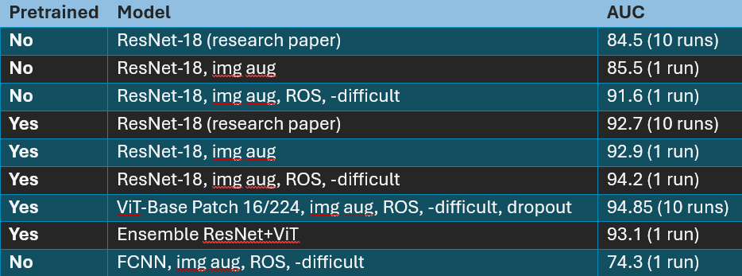
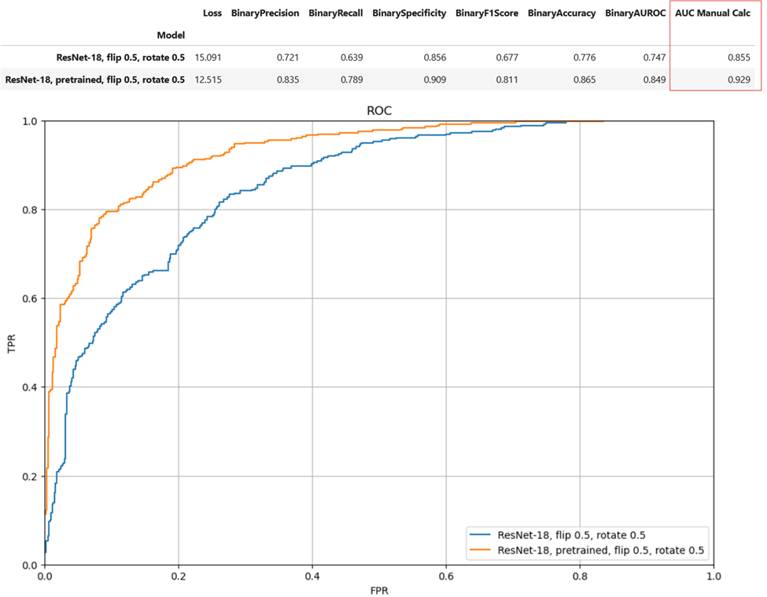
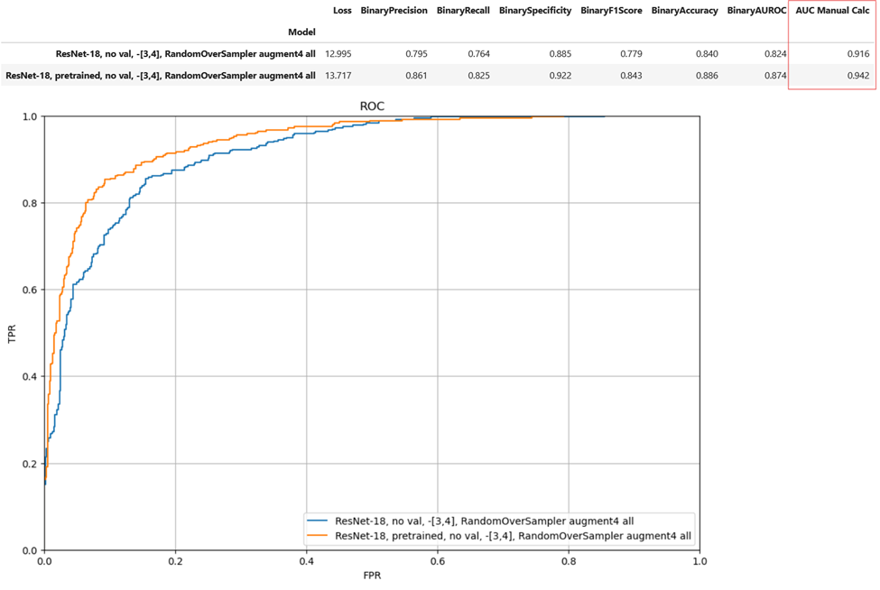
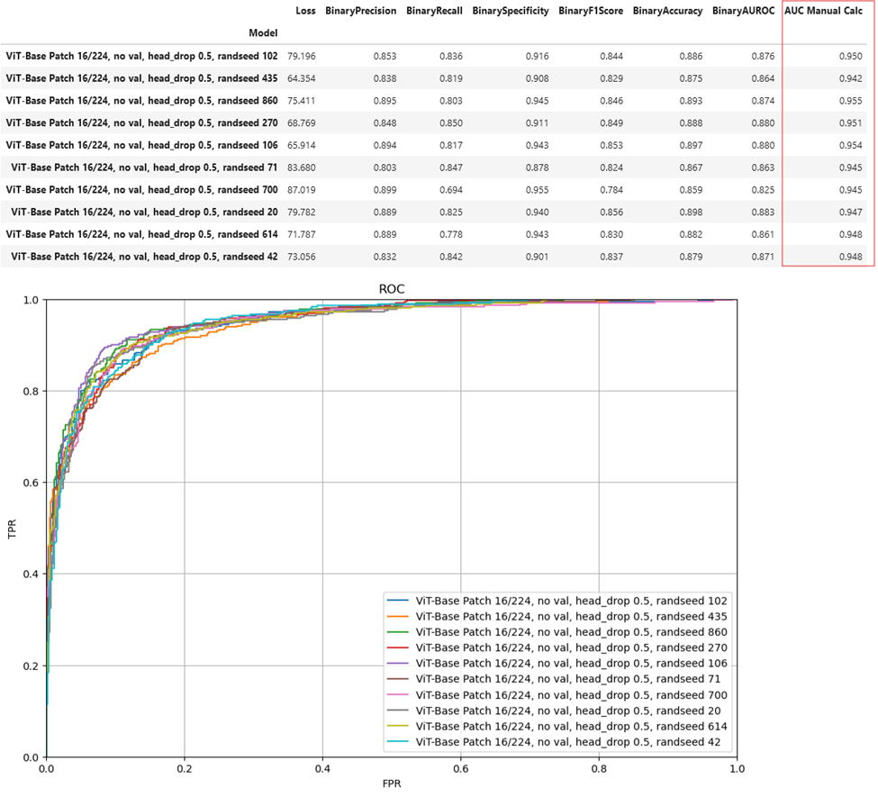
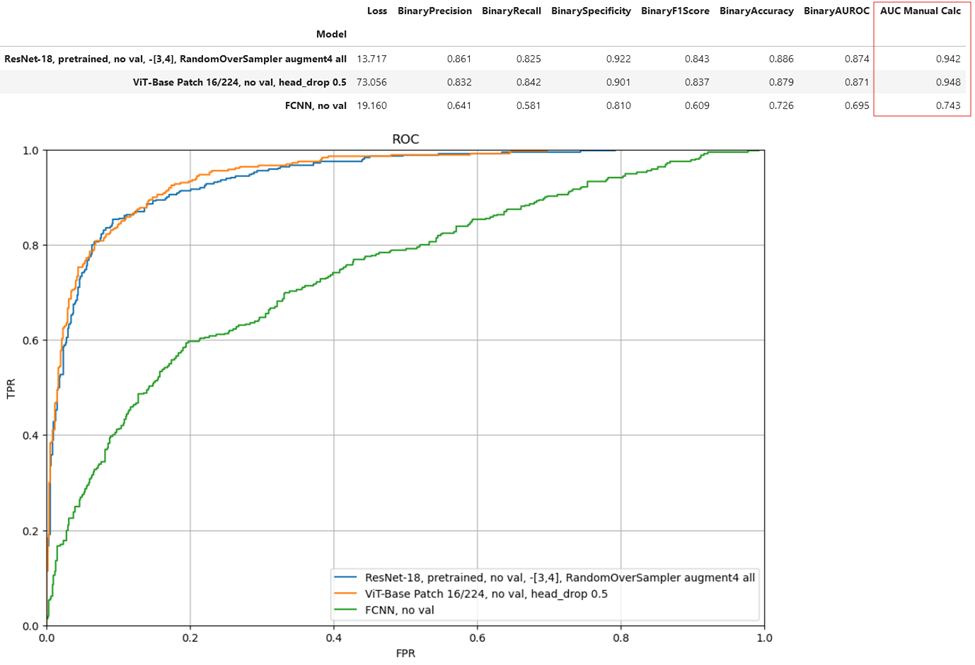

# **<u>Histopathology Image Classification</u>**

[Image source](https://commons.wikimedia.org/wiki/File:Sessile_serrated_adenoma_3_intermed_mag.jpg)

[Original paper - A Petri Dish for Histopathology Image Analysis (2021)](https://arxiv.org/abs/2101.12355)

This is my first deep learning and computer vision project. I've summarized the project below, and you can [download my full report here.](../assets/pdf/MHIST%20Project%20Report.pdf)

You can [find the code repo here.](https://github.com/rfdspeng/ml_ai_portfolio/tree/main/mhist)

**Libraries used: torch, torchvision, torchmetrics, timm, matplotlib, numpy, pandas**

 
## **<u>Research Paper Summary</u>**

The paper is well-written, so I'll only provide a brief overview of the dataset and objective. The authors collected histopathology images (microscopic images of the tissues used in disease analysis) of colorectal polyps and asked a board of 7 doctors to label each image as either hyperplastic polyps (HP) or sessile serrated adenomas (SSA) . HPs are benign, and SSAs are precancerous. The authors then trained various ResNet models on the dataset and reported AUC.

Each sample is a 224x224 color image that is labeled HP or SSA based on the majority vote (out of 7).

The dataset is split into training (2175 samples) and testing (977 samples). The classes are imbalanced. Training contains 71% HP and 29% SSA; testing contains 63% HP and 37% SSA.

The authors trained each model on the entire training set over 100 epochs. At each epoch, they evaluated AUC on the test set. After training, they take the 5 highest AUCs. They train each model 10 times over 10 random seeds, which gives 50 AUC values. They report the AUC mean and standard deviation. (I didn't check their code repo; this explanation is based on the paper.)

The authors tried ResNet-18, ResNet-34, ResNet-50, ResNet-101, and ResNet-152, and found that increasing model depth does not improve performance. This aligns with my experimental results - my training results showed that ResNet-18 overfits, so the challenge is to improve generalization.

The authors found that pretraining significantly improves performance. On ResNet-18,
* Without pretraining, mean AUC = 84.5
* With pretraining, mean AUC = 92.7

The authors found that removing difficult images (images where the doctors were split 3/7 or 4/7) may improve performance.

 
## **<u>Project Summary</u>**

### **<u>Process</u>**
1.	Copied the model (ResNet-18) and training hyperparameters (learning rate and scheduler, batch size, optimizer) from the research paper
2.	Split training set into training (80%) and validation (20%), stratified on voting count. I chose holdout validation over cross-validation to experiment more quickly.
3.	Used early stopping on the training process triggered on validation F1 score and loaded the model state from the best epoch
4.	ResNet-18 experiments: image augmentation, removing difficult images, class balancing, and transfer learning
5.	Switched models to ViT-Base Patch 16/224, using the best hyperparameters from the ResNet-18 experiments as the starting point
6.	ViT experiments: learning rate, effective batch size (gradient accumulation), dropout, and weight decay
7.	Tried ensembling with the best ResNet and ViT models
8.	For academic purpose, tried FCNN with 4 fully-connected layers (128 neurons, 64, 32, 1). I chose these layers so the FCNN has roughly the same number of parameters as ResNet-18.

 
### **<u>Performance</u>**
**Performance summary:**

First, let me explain the abbreviations in the table:
* img aug = image augmentation, flip + rotation on all samples
* ROS = random oversampling
* -difficult = removing images from the training set with 3/7 and 4/7 voting

 
### **<u>Research Paper Comparison</u>**
I was able to replicate the research paper performance for both non-pretrained and pretrained ResNet-18. See the rows for **ResNet-18, img aug**.

 
### **<u>ResNet-18 Improvement</u>**
I was able to improve performance over the research paper with additional generalization techniques. See the rows for **ResNet-18, img aug, ROS, -difficult**.

 
### **<u>ViT-Base Patch 16/224 Performance</u>**
ViT-Base Patch 16/224 performance is similar to ResNet-18.

